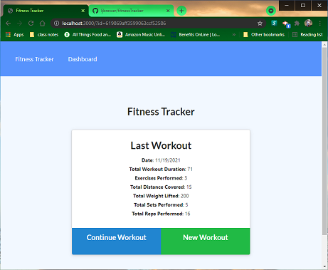

# 18 Fitness Tracker

-----------------------------------------

## Table of Contents

* [Title](#Title:)
* [Task](#Task)
* [Link to GitHub repository](#Link-to-GitHub-repository)
* [picture of page](#picture-of-page:)

-----------------------------------------

## Description

* As a user, I want to be able to view create and track daily workouts. I want to be able to log multiple exercises in a workout on a given day. I should also be able to track the name, type, weight, sets, reps, and duration of exercise. If the exercise is a cardio exercise, I should be able to track my distance traveled.

A consumer will reach their fitness goals more quickly when they track their workout progress.

------------------------------    
### Title

Fitness Tracker

--------------------------------------------------------------------------------
### Task

When the user loads the page, they should be given the option to create a new workout or continue with their last workout.

The user is able to:

  *  add  exercises to the most recent workout plan.

  *  add new exercises to a new workout plan.

  *  view the combined weight of multiple exercises from the past seven workouts on the Dashboard page.

  *  view the total duration of each workout from the past seven workouts on the Dashboard page.

--------------------------------------------------------------------------------
### Link to GitHub repository 

https://github.com/ljbrewer/fitnessTracker

--------------------------------------------------------------------------------
### picture of page:

-------------------------------------------------------------------------------
### Link to Application

TBD
--------------------------------------------------------------------------------
#### Credits: 

This program was created by Laura Brewer